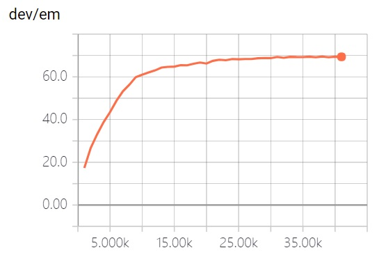
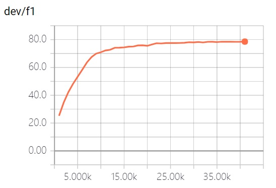

# R-Net
  * A Tensorflow implementation of [R-NET: MACHINE READING COMPREHENSION WITH SELF-MATCHING NETWORKS](https://www.microsoft.com/en-us/research/wp-content/uploads/2017/05/r-net.pdf). This project is specially designed for the [SQuAD](https://arxiv.org/pdf/1606.05250.pdf) dataset.
  * Should you have any question, please contact Wenxuan Zhou (wzhouad@connect.ust.hk).

## Requirements

There have been a lot of known problems caused by using different software versions. Please check your versions before opening issues or emailing me.

#### General
  * Python >= 3.4
  * unzip, wget
#### Python Packages
  * tensorflow-gpu >= 1.5.0
  * spaCy >= 2.0.0
  * tqdm
  * ujson

## Usage

To download and preprocess the data, run

```bash
# download SQuAD and Glove
sh download.sh
# preprocess the data
python config.py --mode prepro
```

Hyper parameters are stored in config.py. To debug/train/test the model, run

```bash
python config.py --mode debug/train/test
```

To get the official score, run

```bash
python evaluate-v1.1.py ~/data/squad/dev-v1.1.json log/answer/answer.json
```

The default directory for tensorboard log file is `log/event`

## Detailed Implementaion

  * The original paper uses additive attention, which consumes lots of memory. This project adopts scaled multiplicative attention presented in [Attention Is All You Need](https://arxiv.org/abs/1706.03762).
  * This project adopts variational dropout presented in [A Theoretically Grounded Application of Dropout in Recurrent Neural Networks](https://arxiv.org/abs/1512.05287).
  * To solve the degradation problem in stacked RNN, outputs of each layer are concatenated to produce the final output.
  * When the loss on dev set increases in a certain period, the learning rate is halved.
  * During prediction, the project adopts search method presented in [Machine Comprehension Using Match-LSTM and Answer Pointer](https://arxiv.org/abs/1608.07905).
  * To address efficiency issue, this implementation uses bucketing method (contributed by xiongyifan) and CudnnGRU. The bucketing method can speedup training, but will lower the F1 score by 0.3%.

## Performance

#### Score

||EM|F1|
|---|---|---|
|original paper|71.1|79.5|
|this project|71.07|79.51|





#### Training Time (s/it)

||Native|Native + Bucket|Cudnn|Cudnn + Bucket|
|---|---|---|---|---|
|E5-2640|6.21|3.56|-|-|
|TITAN X|2.56|1.31|0.41|0.28|

## Extensions

These settings may increase the score but not used in the model by default. You can turn these settings on in `config.py`. 

 * [Pretrained GloVe character embedding](https://github.com/minimaxir/char-embeddings). Contributed by yanghanxy.
 * [Fasttext Embedding](https://fasttext.cc/docs/en/english-vectors.html). Contributed by xiongyifan. May increase the F1 by 1% (reported by xiongyifan).

